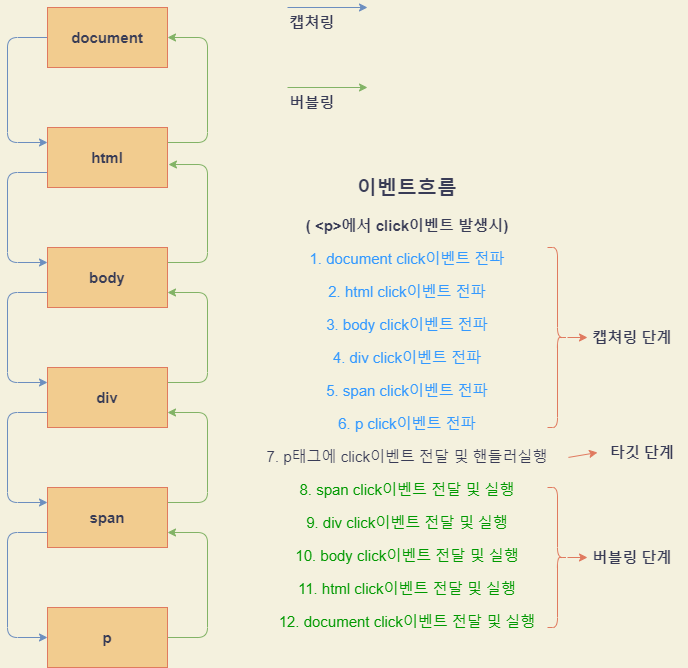

https://ko.javascript.info/
두 번째 파트 - 브라우저에서의 자바스크립트

# 기본용어
1. Window: 전역객체이며, 브라우저를 대신해서 여러가지 정보를 담고 있음
2. DOM : Document Object Model
3. BOM : Browser Object Model

# 1. DOM트리
## 1.1 유명한 태그
1. `<html>` = document.documentElement
2. `<head>` = document.head
3. `<body>` = document.body

## 1.2 용어정리
1. 자식노드 : 바로 하위에 있는 노드
2. 후손노드 : 하위에 있는 노드

## 1.3 자식 / 후손노드들
### 1.3.1 텍스트, 주석노드들을 포함한 노드들 반환
* childNodes : 자식노드들
* firstChild : 첫번째 자식노드
* lastChild : 마지막 자식노드
* previousSibling : 이전 형제노드
* nextSibling : 이전 형제노드
* parentNode : 부모노드
### 1.3.2 요소노드만 반환
* children
* firstElementChild
* lastElementChild
* previousElementSibling
* nextElementSibling
* parentElement   ( 부모가 노드가 아니면 null반환 )

## 1.4 getElement / querySelector
### 1.4.1 document.getElementById("#app")
id값으로 element검색
``` html
<!DOCTYPE html>
<html lang="ko">
<head>
  <title>Document</title>
</head>
<body>
  <div id="id">
    hi
  </div>
  
  <div id="id-div">
    bye
  </div>
  
  <script>
    document.getElementById(id).backgrond = "red";
    id.backgrond = "red";                   // id는 전역변수로 접근가능
    window['id-div'].background = "red";    // 단 id-div처럼적은경우 window객체로 접근가능... 좋지않은방법
  </script>
</body>
</html>
```
### 1.4.2 document.querySelector()
클래스나 태그이름으로 요소 검색 ( 맨처음 검사되는놈 하나만 반환 )
### 1.4.3 document.querySelectorAll()
클래스나 태그이름으로 요소 검색   
모든 요소를 찾고 NodeList로 반환해줌, NodeList는 배열은 아니지만 유사배열이여서 반복문에 사용가능 ( 배열메서드사용불가능 )   
배열메서드 사용하려면 `Array.from()`을 이용해서 배열로 변환후 배열메서드를 사용할 수 있음
### 1.4.4 matches
주어진 선택자와 일치하는지 검사
### 1.4.5 closest
자기자신을 포함한 선택자가 가장 가까운 조상을 반환
### 1.4.6 getElementBy*
이제는 안쓰는 태그들
* getElementsByTagName(tag)
* getElementsByClassName(className)
* getElementsByName(name)
이친구들은 중간에 태그가 늘어나면 그것까지 포함함 ( 참조 )    
하지만 querySelector()는 중간에 늘어나도 최초 얻어왔을 때 태그들만 사용  ( 복사 )   

<br />
<hr />
<br />

# 2. 주요 프로퍼티
## 2.1 nodeType
1. 요소노드 1
2. 텍스트노드 3
3. 문서객체 9

## 2.2 nodeName
모드 노드에 사용가능하며, 노드의 이름을 출력해줌

## 2.3 tagName
태그에만 사용가능 

## 2.4 innerHTML
요소내 HTML을 문자열형태로 받아옴... ( 쓰기도가능 )
`+=` 사용시 기존내용삭제 -> 기존내용 + 새내용추가

## 2.5 nodeValue, data
nodeValue나 data나 별차이없음... 각 태그내의 텍스트노드를 보여줌    
텍스트노드.data ( 쓰기도 가능, 주석노드에도 가능 )   
근데 요거 안되던데...?

## 2.6 textContent
요소내 태그제외하고 텍스트만 출력해줌
태그노드.textContent

## 2.7 hidden
`display: none;`와 동일함
태그노드.hidden = true;   // display: none; 적용

## 2.7 예시
```html
<div>Hello</div>

<script>
  const $div = document.querySelector("div");

  console.log($div.nodeType);     // 1
  console.log($div.nodeName);     // "DIV"
  console.log($div.tagName);      // "DIV"
  console.log($div.innerHTML);    // "Hello"
  console.log($div.textContent);  // "Hello"
  console.log($div.hidden);       // true...  false로 바꾸면 숨겨짐
</script>
```
<br />
<hr />
<br />

# 3. 태그속성과 프로퍼티
태그속성중에 표준속성은 DOM노드객체의 프로퍼티로 변환하지만 비표준속성은 변환되지않음  ( 태그마다 표준이 다르므로 태그마다 적용되는 프로퍼티가 다름 )

## 3.1 비표준속성 사용
* hasAttribute(name) : 속성 존재 여부 확인
* getAttribute(name) : 속성값을 가져옴
* setAttribute(name, value) : 속성값을 변경함
* removeAttribute(name) : 속성값을 지움

## 3.2 프로퍼티값 타입 예외
항상 프로퍼티의 타입이 문자열은 아님
* input.checked는 Boolean
* div.style은 Object

## 3.3 dataset
속성명이 `data-*`형태라면 javascript에서 사용할 때 `태그.dataset.*`형태로 사용하면됨   
단, 속성명에서 -으로 구분한것은 js에서 대문자로 구분
``` html
<!DOCTYPE html>
<html lang="ko">
  <head>
    <title>Document</title>
    <style>
      .order[data-user-info="john"] {
        color: green;
      }

      .order[data-user-info="abel"] {
        color: blue;
      }
    </style>
  </head>
  <body>
    <!-- 초록색적용 -->
    <div class="user1" data-user-info="john">john, 안녕</div>

     <!-- 파란색적용 -->
    <div class="user2" data-user-info="abel">abel, 안녕</div>
    <script>
      const divNode = document.querySelector(".user1");
      console.log(divNode.dataset.userInfo);     //john
    </script>
  </body>
</html>
```

<br />
<hr />
<br />


# 4. 스타일속성
## 4.1 표기법
`element.style.color = red;`   
카멜표기법으로 자동으로 변함 ( z-index => zIndex )

## 4.2 style없애기
`element.style.display = "none";`를 지정했다면   
`element.style.display = "";`를 하면 element의 display속성이 무시됨

## 4.3 style.cssText
```javascript
element.style = "color: red; width: 100px";             // 불가능한방법   
element.style.cssText = "color: red; width: 100px";     // 가능한방법   
```

## 4.4 getComputedStyle()
태그에 적용된 스타일값들을 가져옴 ( class로 적용된 스타일도 가져옴 )    
`getComputedStyle(태그명).backgroundColor;`

## 4.5 className
`태그.className = "active";`    
클래스 전체가 수정됨

## 4.6 classList
클래스중 일부만 추가 및 삭제 가능 ( 이터러블 객체임 )
### 4.6.1  add
`element.classList.add();`
### 4.6.2 remove
`element.classList.remove();`
### 4.6.3 toggle
`element.classList.toggle();`
### 4.6.4 contains
포함여부에 따라 t/f로 반환    
`element.classList.toggle();`

```html
<head>
  <style>
    btn{
      color: red;
      font-size: 1rem;
    }
  </style>
</head>

<body>
  <button type="button" class="btn" style="curser: pointer;">click me </button>
</body>

<script>
  const $btn = document.querySelector(".btn");
  $btn.style.fontSize = "2rem";         // 4.1 표기법 변환
  console.log($btn.style.color);        // red
  console.log($btn.style.cssText);      // curser: pointer;
  console.log(getComputedStyle($btn).cursor);   // pointer 
  console.log(getComputedStyle($btn).color);    // rgb(0, 0, 255);
  console.log($btn.className);          // btn
</script>
```

<br />
<hr />
<br />

# 5. 기하프로퍼티 (geometry)
엘리먼트의 바깥부분의 크기나 전체크기등을 보여줌    
보이지않는 요소에는 사용할 수 없음

## 5.1 offsetParent
CSS position 프로퍼티가 absolute나 relative, fixed, sticky인 가장 가까운 조상 요소    
단, offsetParent가 null이 될 수 있음
+ 화면에 보이지않는 요소
+ `<body>`, `<html>`
+ `position: fixed;`

## 5.2 offsetLeft/offsetRight
top과 right의 값이지만 실제 적용된 값을 숫자로 반환해줌   
```css
.title{
  position: absolute;
  top: 50px;
  right: 50px;
}
```
위와 같은 경우에는 top과 right에 50씩 적용되지만, 만약 position값이 absolute가 아니라면 적용안되므로 top, right값이 0이 됨

## 5.3 offsetWidth/offsetHeight
border + padding + scrollbar + contentSize를 합친 길이를 숫자로 반환

## 5.4 clinetTop/clientLeft
테두리(border)의 넓이를 알려주는데 scrollbar가 존재하는 경우 scrollbar도 합쳐서 숫자로 반환해줌

## 5.5 clinetWidth/clientHeight
content + padding을 숫자로 반환 ( 단, 스크롤바 제외 )

## 5.6 scrollWidth/scrollHeight
content + padding을 숫자로 반환 ( 단, 스크롤바 포함 )

## 5.7 scrollLeft/scrollTop
가로/세로 스크롤이 움직임에 따라서 숨겨진 위쪽 혹은 좌측의 길이를 숫자로 반환

<br />
<hr />
<br />

# 6. 브라우저창/스크롤이동
document.documentElement는 `<html>`을 가리킴    

## 6.1 브라우저창
### 6.1.1 너비, 높이구하기
```javascript
document.documentElement.clinetWidth;   // 스크롤바 미포함
window.innerWidth;                      // 스크롤바 포함
```
### 6.1.2 <!DOCTYPE HTML>
이게 없으면 기하프로퍼티값이 이상하게 나옴
### 6.1.3 문서의 정확한 높이를 구하는법
```javascript
let scrollHeight = Math.max(
  document.body.scrollHeight, document.documentElement.scrollHeight,
  document.body.offsetHeight, document.documentElement.offsetHeight,
  document.body.clientHeight, document.documentElement.clientHeight
);
```

## 6.2 스크롤이동
### 6.2.1 문서자체의 스크롤에 의해 숨겨진영역길이 구하기
`document.documentElement.scrollTop`으로 구할 수 있긴하지만 브라우저별 예외상황이 있기 때문에 `window.pageYOffset`를 사용하면 예외없이 정확한 값을 얻을 수 있음
```javascript
window.pageYOffset;   // 세로
window.pageXOffset;   // 가로
```

### 6.2.2 window.scrollTo(x, y)
페이지 스크롤을 절대위치 x, y로 옮김

### 6.2.3 window.scrollBy(x, y)
페이지 스크롤을 상대위치 x, y로 옮김

### 6.2.4 element.scrollIntoView()
+ `element.scrollIntoView(true)`: 현재 element가 브라우저 맨위에 붙도록 스크롤이 이동함 ( 디폴트값 )
+ `element.scrollIntoView(false))`: 현재 element가 브라우저 맨아래에 붙도록 스크롤이 이동함

### 6.2.5 스크롤 막기
`document.body.style.overflow = "hidden"`스크롤이 사라지며 화면을 움직일 수 없음    
`document.body.style.overflow = ""` 해제    
단, 주의해야할점은 스크롤이 사라지면 원래 스크롤 영역만큼 컨텐츠가 이동해서 레이아웃이 깨질 수 있기 때문에 스크롤을 없앨때 스크롤 크기만큼의 padding값을 주는것이 좋음

<br />
<hr />
<br />

# 7. 좌표
좌표는 크게 두개로 나눠지는데
1. 창 기준 - 현재 창의 왼쪽위를 기준으로 함 ( clientX/clientY )
2. 문서 기준 - 문서의 왼쪽위를 기준으로 함 ( pageX/pageY )

## 7.1 element.getBoundingClientRect()
DOMRect클래스의 객체를 반환함   
1. x : 문서의 위쪽 - 요소를 감싸는 네모의 위쪽
2. y : 문서의 왼쪽 - 요소를 감싸는 네모의 왼쪽
3. width : 요소를 감싸는 네모의 width
4. height : 요소를 감싸는 네모의 height
5. right : x + right
6. bottom : y + height    
https://ko.javascript.info/coordinates#ref-577 참고


## 7.2 document.elementFromPoint(x, y)
```javascript
const element = document.elementFromPoint(x, y);
```
x, y로 지정한 좌표와 가장 가까운 element를 반환함   
단, x나 y가 최대범위초과시 null반환

<br />
<hr />
<br />

# 8. 이벤트
## 8.1 이벤트종류
### 8.1.1 마우스이벤트
|이벤트|설명|
|---|------|
|click|요소위에서 마우스 왼쪽버튼 눌렀을 때 실행|
|contextmenu|요소위에서 마우스 오른쪽버튼이 눌렀을 때 실행|
|mouseover|마우스커서가 요소위로 들어올 때 실행|
|mouseout|마우스커서가 요소밖으로 나갈 때 실행|
|mousedown|요소위에서 마우스 왼쪽버튼을 누르고 있을 때 실행|
|mouseup|요소위에서 마우스 버튼을 뗄 때 실행|
|mousemove|마우스를 움직일 때 실행|

### 8.1.2 폼이벤트
|이벤트|설명|
|---|------|
|submit|form제출시 실행|
|focus|요소에 포커스 할 때 실행|

### 8.1.3 키보드 이벤트
|이벤트|설명|
|---|------|
|keydown|사용자가 키보드를 누를 때 실행|
|keyup|사용자가 키보드를 뗄 때 실행|

### 8.1.4 문서이벤트
|이벤트|설명|
|---|------|
|DOMContentLoaded|html이 모두 로드되어 DOM이 생성완료했을 때 실행|

### 8.1.5 css이벤트
|이벤트|설명|
|---|------|
|transitionend|애니메이션 종료되었을 때 실행|

## 8.2 이벤트 핸들러
이벤트에 반응해서 실행할 함수를 의미

### 8.2.1 이벤트 핸들러 할당 - 1
HTML태그내부에 `on<event>`속성에 핸들러를 넣으면 이벤트를 붙일 수 있음    
`this`로 해당 노드에 접근가능

### 8.2.2 이벤트 핸들러 할당 - 2
DOM의 프로퍼티로 할당하는 방법 `element.onclick = "function(){ alter('클릭') }`    
단, 이 방법으로는 하나의 이벤트만 장착할 수 있음 ( 기존이벤트를 덮어씌워짐 )    
제거시 `element.onclick = null`하면 됨

### 8.2.3 이벤트 핸들러 할당 - 3 
기존 방식에는 복수의 이벤트를 장착할 수 없는 문제가 존재해서 생겨난 방식    
`element.addEventListener(event, handler, [options])`
+ `DOMContentLoaded`의 경우 addEventListener로만 할당됨

### 8.2.4 이벤트 할당 해제
이전에 등록한 handler를 함수로 저장해놓지않으면 이벤트를 제거할 수 없음   
똑같이 생긴함수라더라도 다른 함수로 취급됨
`element.removeEventListener(event, handler, [options])`

```html
<!DOCTYPE html>
<html lang="ko">
  <head>
    <title>Document</title>
  </head>

  <body>
    <!-- 1. 태그에 직접 이벤트 달기 -->
    <div onClick="alter('클릭')">click me</div>

    <!-- 1-1. 정의한 함수를 이용해 태그에 직접 이벤트 달기 -->
    <div onClick="clickEvent()">click me</div>

    <script>
      const $div = document.querySelector("div");

      function clickEvent(e){
        alter("클릭");
      }

      // 2. DOM요소로 이벤트 달기
      $div.onClick = function(){ alter('클릭') }

      // 2-1. 정의한 함수를 이용해 DOM요소로 이벤트 달기
      $div.onClick = clickEvent;

      // 3. addEventListener()사용
      $div.addEventListener(
        "click",
        clickEvent,
        {
          once: true,     // 한번 실행하고 이벤트 장착해제
          capture: true,  // 이후에 설명
          passive: true   // true이면 preventDefault()를 호출하지 않음
        }
      );

      // 4. removeEventListener()사용
      $div.removeEventListener(
        "click",
        clickEvent,
        {
          once: true,
          capture: true,
          passive: true
        }
      );

    </script>
  </body>
</html>
```

## 8.3 이벤트 객체
```html
<!DOCTYPE html>
<html lang="ko">
  <head>
    <title>Document</title>
  </head>

  <body>
    <div>click me</div>

    <script>
      const $div = document.querySelector("div");
      $div.addEventListener("click", e => {
        console.log(e.type);            // click
        console.log(e.currentTarget);   // <div>click me</div>
        console.log(e.clientX);         // x좌표값
        console.log(e.clientY);         // y좌표값
      })
    </script>
  </body>
</html>
```

## 8.4 버블링
한 요소의 이벤트가 발생하면 해당 요소에서 핸들러가 동작한후 부모요소의 핸들러가 동작함 ( 제일위까지 올라감 (document까지올라감) )
```html
  <!DOCTYPE html>
  <html lang="ko" onclick="alert('html click')">

  <head>
    <title>Document</title>
    <link rel="stylesheet" href="./index.css">
    <style>
      div{
        width: 200px;
        height: 200px;
        background: red;
        display: flex;
        justify-content: center;
        align-items: center;
      }

      span{
        display: flex;
        justify-content: center;
        align-items: center;
        width: 100px;
        height: 100px;
        background: orange;
      }

      p {
        display: inline-block;
        width: 50px;
        height: 50px;
        background: blue;
      }
    </style>
  </head>

  <body onclick="alert('body click')">
    <div onclick="alert('div click')">
      <span onclick="alert('span click')">
        <p onclick="alert('p click')"></p>
      </span>
    </div>
  </body>
  </html>
```
`<p>`click이벤트 발생시   
1. alert('p click');
2. alert('span click');
3. alert('div click');
4. alert('body click');
5. alert('html click');

위와 같은 순서로 클릭이벤트가 발생함 ( p -> span -> div -> body -> html )      
<br />
거의 모든 이벤트는 버블링됨

### 8.4.1 event.stopPropagation()
이벤트 버블링 중단

### 8.4.2 event.stopImmediatePropagation()
해당 이벤트 이후로 모든 이벤트의 실행을 막음

## 8.5 캡쳐링
이벤트 전파단계로 document부터 내려옴   
거의 사용할 일 없으며 캡쳐링단계에서 이벤트를 실행하려면 `addEventListener("click", handler, { capture: true })`으로 이벤트등록해주면됨   



## 8.6 event.target
이벤트가 발생한 가장 안쪽요소를 의미    
즉 이벤트가 발생한 노드를 의미

## 8.7 event.currentTarget
현재 이벤트가 발생하고 있는 노드를 의미

```html
<body>
  <div>
    <span>
      <p></p>
    </span>
  </div>

  <script>
    const $div = document.querySelector("div");
    const $span = document.querySelector("span");
    const $p = document.querySelector("p");

    $div.addEventListener("click", e => {
      console.log(e.currentTarget, e.target);
    });
    $span.addEventListener("click", e => {
      console.log(e.currentTarget, e.target);
    });
    $p.addEventListener("click", e => {
      console.log(e.currentTarget, e.target);
    });
  </script>
</body>
```
p클릭시 taget => p고정, currentTarget은 이벤트 버블링에 따라서 부모노드로 올라갈 때 마다 해당 부모노드로 변함

## 8.8 이벤트 위임
### 8.8.1 예시 - 1
각각의 `<li>`에게 이벤트를 넣을 수 있지만 그렇게하는것보단 부모노드인 `<section>`에다가 이벤트를 넣고 e.target을 이용해서 선택한 노드에 값을 변화시켜주면됨
```html
<!DOCTYPE html>
<html lang="ko">
  <head>
    <title>Document</title>
    <style>
      li{
        width: 50px;
        height: 50px;
        background: lightgray;
        border: 1px solid black;
      }
    </style>
  </head>
  <body>
    <section class="container">
      <ul class="head">
        <li></li>
        <li></li>
        <li></li>
        <li></li>
        <li></li>
        <li></li>
      </ul>
    </section>

    <script>
      const $container = document.querySelector(".container");
      const $head = document.querySelector(".head");
      let selectNode = null;

      $container.addEventListener("click", e => {
        if(e.target.tagName !== "LI") return;

        if(selectNode){
          selectNode.style.backgroundColor = "lightgray";
        }

        selectNode = e.target;
        selectNode.style.backgroundColor = "blue";
      });
    </script>
  </body>
</html>
```
### 8.8.2 예시 - 2
자식노드에서 `data-*`를 정의해서 자식노드를 구분하는데 사용하고   
부모노드인 `<div class="container">`에서 click이벤트를 위임받아서 사용함    
이렇게 함으로서 각 자식버튼에 이벤트를 등록할 필요도 없으며, `data-*`와 class의 메서드만 추가해주면 쉽게 확장할 수
```html
<!DOCTYPE html>
<html lang="ko">
  <head>
    <title>Document</title>
  </head>
  <body>
    <div class="container">
      <button type="button" data-action="save">저장</button>
      <button type="button" data-action="load">로드</button>
      <button type="button" data-action="search">검색</button>
    </div>
    
    <script>
      class Menu{
        constructor(element) {
          this._element = element;
          element.addEventListener("click", this.onClick.bind(this));
        }

        onClick(e){
          const action = e.target.dataset.action;
          if(action){
            this[action]();
          }
        }

        save(){
          console.log("save");
        }
        load(){
          console.log("load");
        }
        search(){
          console.log("search");
        }
      }

      const $container = document.querySelector(".container");

      new Menu($container);

    </script>
  </body>
</html>
```

여기부터시작
https://ko.javascript.info/event-delegation

## 8.8 
## 8.8 
## 8.8 
## 8.8 
## 8.8 
## 8.8 
## 8.8 
## 8.8 
## 8.8 


<br />
<hr />
<br />

# 8. 이벤트


<br />
<hr />
<br />

# 8. 이벤트