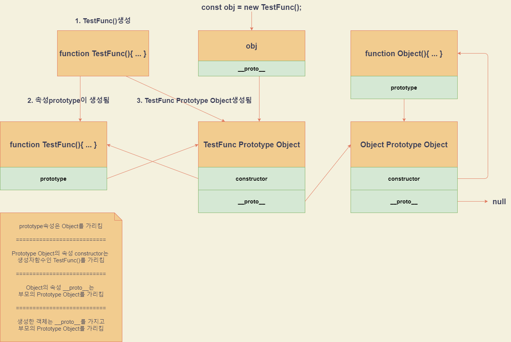

자바스크립트의 프로토타입에 대해서 깊이 이해하고 정리하기 위해 쓴 글

# 프로토타입에 대한 이해
자바스크립트객체는 `[[Prototype]]`이라는 숨김프로퍼티를 가짐    
`__proto__`는 `[[Prototype]]`의 getter/setter이고, 최신 문법으로는 `Object.getPrototypeOf()`와 `Object.setPrototypeOf()`을 사용함   

```javascript
const TestFunc = function(){
  this.a = 1;
  this.b = 2;

  this.func = function(){
    console.log(this.a, this.b)
  }
}
/**
 * TestFunc라는 함수를 생성함과 동시에
 * "TestFunc Prototype Object"가 생성되고 속성값으로 constructor와 __proto__를 가짐
 * constructor는 자신을 생성한 생성자함수 즉, TestFunc를 가리킴
 * __proto__는 생성자함수의 부모의 "TestFunc Prototype Object"를 가리킴, ( "Object Prototype Object"를 가리킴)
 * TestFunc.prototype이 생성되고 "TestFunc Prototype Object"를 가리킴
*/

const obj = new TestFunc();
/**
 * obj에는 { a, b, func, __proto__ }가 들어가 있음
 * __proto__는 "TestFunc Prototype Object"를 가리킴
 */

console.log(obj.c);         // undefined
TestFunc.prototype.c = 3;
console.log(obj.c);         // 3
/**
 * obj를 이용해서 값을 찾을 때 기본적으로 자기자신을 우선적으로 찾고 없다면
 * __proto__를 타고가서 찾음 obj.__proto__는 TestFunc.prototype과 같으므로
 * 생성자로 객체를 생성한 이후에 c라는 속성을 추가해도 객체에서 c라는 값을 찾을 수 있음
 * 
 * 이러한 원리로 obj.__proto__.__proto__는 "Object Prototype Object"이므로 Object의 변수나 메서드들을 모두 사용할 수 있음
 * 모든 객체의 __proto__를 타고가면 Object()가 나오므로 모든 객체는 Object의 메서드를 사용할 수 있지만
 * 
 * ======= 밑에 줄은 무시 =========
 * 직접적으로 __proto__를 변경시킨경우에는 사용할 수 없게됨 ( prototype체인이 망가짐으로 __proto__자체를 변경하기보다는 속성을 추가하는것이 좋음 )
 * obj.__proto__ = { a: 10, b: 20 };  // X
 * obj.__proto__.a = 10;              // O
 * obj.__proto__.b = 20;
 */
```




# 참고사이트
1. https://ko.javascript.info/prototypes
2. https://medium.com/@bluesh55/javascript-prototype-%EC%9D%B4%ED%95%B4%ED%95%98%EA%B8%B0-f8e67c286b67