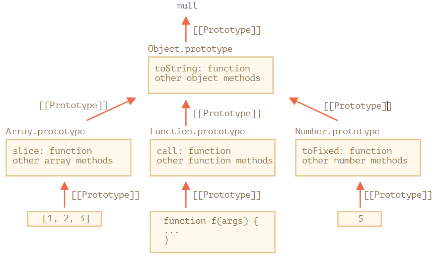

###### https://ko.javascript.info/ 를 읽으면서 정리하는 파일
1. 조금이라도 이해안가는 부분이 있으면 다시 공부하기
2. 힘들다고 타협해서 대충알고 넘어가지않기

<br />
<hr />
<br />

# 자바스크립트
웹페이지에 생동감을 불어넣기위해 만들어진 프로그래밍 언어

# 1. 자료형
자바스크립트는 동적타입언어임 ( 변수에 어떤 자료형이든 넣을 수 있고 바꿀 수 있음 )

자바스크립트의 자료형은 8가지
1. number
2. bigint
3. string
4. boolean
5. null
6. undefined
7. object
8. symbal

<br />
<hr />
<br />

# 2. 형변환
1. String()
2. Number()
3. Boolean()

<br />
<hr />
<br />

# 3. 연산자
## 3.1. +
1 + 1       => 1
1 + '1'     => '11'
1 + 1 + '1' => '21'  // 왼 -> 오 순으로 연산하기 때문
## 3.2. 단항 덧셈연산자
숫자형으로 변환시켜줌 ( Number()와 같음 )
'2' + '3' => '23'
+'2' + +'3' => 5
## 3.3. 비교연산자
비교기준은 사전순 ( 정확히는 유니코드순 )
'z' > 'a' => true
'a' > 'A' => true   // a = 97, A = 65
## 3.4. 일치연산자와 동등연산자
동등연산자 : ==
일치연산자 : ===

동등연산자는 연산을 수행하기전 피연산자들의 자료형이 불일치하면 숫자형으로 변경후 연산함
따라서 0, "", null, undefined, NaN 이 5가지를 구분하지 못함
일치연산자는 자료형이 불일치하면 바로 false를 리턴함
## 3.5. ||, 단락평가
||는 가장먼저 truthy인 값을 원래형태로 반환함 (왼 -> 오)
하지만 전부 falsy라면 맨오른쪽값을 반환함
let a;
const x = a || "b";   // x에는 'b'가 들어감
x || alert("c");      // alert는 실행되지 않음 ( 단락평가 )

## 3.6. &&
&&는 가장먼저 falsy인 값을 원래형태로 반환함 (왼 -> 오)
하지만 전부 truthy라면 맨오른쪽값을 반환함
const x = 1 && 0 && 'x';    // 0    // t f t기때문에 두번째 f인것의 원래값인 0을 반환
const x = 1 && 'k' && 'x';  // 0    // 전부 true

## 3.7. ??
const v = a ?? b;    // const v = (a !== null && a !== undefined) ? a : b; 같은의미 문장
a가 null이아니고 undefined가 아닌경우 a리턴 아니면 b리턴
??는 ||, &&와 같이 사용할 수 없음, 단 괄호사용시 같이사용가능   // (1 && 2) ?? 3

<br />
<hr />
<br />

# 4. for문
for(begin; condition; step){
  Content
}
begin : for문 시작시 한번만 실행  ( 생략가능 )
condition : 값이 truthy일 때 실행
Content : 반복할 코드
step : content끝나고 실행   ( 생략가능 )
begin은 한번만 실행하고 나머지 순서대로 실행함
생략가능한 부분은 생략해도 되지만 세미콜론은 생략하면 안됨

<br />
<hr />
<br />

# 5. symbol
유일한 식별자를 만드는 데 사용
``` javascript
const id1 = Symbol("id");
const id2 = Symbol("id");
id1 === id2;      // false
```
## 5.1. symbol의 형변환
symbol은 암시적으로 형변환되지않아서 alert()에 사용하면 에러발생
.toString(), .description 을 사용하면 형변환가능
## 5.2. 객체를 식별하는 유일한 식별자로 사용
let id = Symbol("id");
user[id] = "admin";
오직 user[id]로만 "admin"이라는 value값을 얻을 수 있음
## 5.3. for-in문 배제
symbol형으로 만든 key는 for-in문, Object.key()에서 배제됨
단, Object.assign()으로 인한 복사에서는 복사됨
## 5.4. 전역심볼
전역 심볼 레지스트리라는 공간이 있는데 이곳에 심볼을 심으면 동일한 심볼값을 얻을 수 있음
``` javascript
const id = Symbol.for("id");
const id2 = Symbol.for("id");
id === id2;   // true
```
## 5.5. Symbol.keyFor
전역 심볼의 이름을 얻을 수 있음
Symbol.keyFor(id);    // id
없으면 undefined반환

<br />
<hr />
<br />

# 6. Number
```javascript
const n = 1.0bn;    // 100000000 (1억)
const n = 1e3;      // 1000
const n = 1e-3;     // 0.001
```

<br />
<hr />
<br />

# 7. Object
    key와 value로 구성된 property의 집합  
    key는 문자열, 심볼형만 허용됨  
    value는 어떤자료형도 허용됨  

## 7.1. 객체생성
    1. 객체 리터럴 : const obj = {};
    2. 객체 생성자 : const obj = new Object;
## 7.2. 객체삭제
    delete obj.x;
## 7.3. 계산된 프로퍼티
``` javascript
const fruit = "apple";
const obj = {
  [fruit]: "500원",   // fruit값이 계산되어서 key로 들어감
}
```
## 7.4. 단축프로퍼티
``` javascript
const fruit = "apple";
const obj = {
  fruit,
}
```
## 7.5. 프로퍼티 key의 제약
    프로퍼티의 key값은 예약어도 사용가능하며, 다른 자료형일경우 자동적으로 문자로 변환됨
    단, 하나의 예외는 obj.__proto__
## 7.6. in 연산자
    객체의 프로퍼티가 존재하는지 key값을 이용해 판단
    "key" in obj;   // "key"라는 key값이 obj에 존재하면 true반환
## 7.7. 객체정렬방식
    key값이 정수프로퍼티인경우는 자동적으로 오름차순정렬이 되어서 for-in문에 사용되고 그외에는 추가한 순서대로 반복
    여기서 정수프로퍼티란 변형없이 정수와 문자열을 왔다갔다할 수 있는 문자열을 의미 ( "10" )
    단, 정수와 문자열이 같이 섞인경우 정수 ~ 입력한 문자열순서대로 출력
## 7.8. Object.assign
    객체를 얕은 복사를 하거나 새로운 값으로 합칠 때 사용
    const cloneObject = Object.assign(dest, [obj1, obj2, ...]);
    dest : 합쳐질 객체의 결과값을 받을 변수
    obj1 : 합쳐질 객체들
    반환값과 dest값은 일치함
    동일한 key값을 갖는 객체가 존재하면 늦게 적은것이 앞에 적은것의 value를 덮어씌움
## 7.9. this
    메서드에서 this는 런타임에 결정되며, 해당 메서드를 가진 객체와 정확히 일치함
    런타임시 결정된다 => 호출시 결정된다.
## 7.10. 생성자함수
    사실 어떤 함수도 new를 붙여서 생성하면 생성자 함수임 ( 다만 관례적으로 생성자 함수는 대문자로 시작함 )
``` javascript
function User(name){
  this.name = name;
}
const obj = new User("john");
// 위와 같은 코드가 있다면 생성자함수를 만들때 즉, new를 붙이면 내부적동작은
// 1. 빈객체 this를 생성함
// 2. 마지막에 this를 반환함
function User(name){
  this = {};
  this.name = name;
  return this;
}
```
## 7.11. 객체를 원시형으로 형변환
    객체를 형변환할 때는 "hint"라는 값을 기준으로 변환함  ( hint는 목표자료형정도로 생각 )
    hint값은 string, number, default가 될 수 있음
    console.log(obj);   // hint => string
    +obj;               // hint => number
    obj + 1;            // hint => default (정수도가능, 문자열도가능)
## 7.12. 형변환규칙
    1. obj[Symbol.toPrimitive](hint)가 존재하는지 찾고 있으면 이것을 호출 (반드시 원시값반환해야함 아니면 오류발생)
    2. 1이 없고 hint가 string이라면 .toString() or .valueOf() 호출
    3. 1, 2가 없고 hint가 number or default라면 .valueOf() or .toString() 호출
``` javascript
const user = {
  name: "apple",
  money: 1000,
  [Symbol.toPrimitive](hint) {    // 1의 경우
    return hint == "string" ? this.name : this.money;
  },
  toString(){     // 1이 없으면 실행
    return this.name + "111";
  },
  valueOf(){      // 1, 2가 없으면 실행
    return this.money;
  }
}
```

<br />
<hr />
<br />

# 8. string Method
## 8.1. charAt()
인덱스범위초과시 빈문자열 반환
## 8.2. length
프로퍼티임, 메서드 X ( length() )
## 8.3. toLowerCase(), toUpperCase()
## 8.4. indexOf(subStr, [pos])
"index in idx".indexOf("in", [시작인덱스]);
문자열중에 'in'의 시작인덱스를 반환 ( 없을경우 -1 )
시작인덱스를 지정하면 그 위치 이후부터 탐색
대.소문자 구분함
## 8.5. includes(subStr, [pos])
문자열 포함여부 반환 ( 문자열존재시 true )
## 8.6. startsWith(subStr), endsWidth(subStr)
subStr로 시작하는지/끝나는지 확인
## 8.7. str.slice(start, [end])
str의 start인덱스부터 end인덱스까지 반환 ( end인덱스는 미포함 ), slice(-4, -1)허용
## 8.8. str.subString(start, [end])
str의 start인덱스부터 end인덱스까지 반환 ( end인덱스는 미포함 ), subString(6, 2)허용
## 8.9. str.substr(start, [length])
str의 start부터 length개 반환
## 8.10. str.split(delimiter, [length])
delimiter를 기준으로 문자열을 잘라서 배열로 만들고 리턴,  length존재시 해당개수만큼만 잘라서 배열만듦

<br />
<hr />
<br />

# 9. Array
배열의 자료형은 Object
기본적으로 참조에 의한 복사
## 9.1. 선언
1. let arr = new Array();
2. let arr = [];

## 9.2. Array Method
### 9.2.0. includes(item, from), indexOf(item, from)
### 9.2.1. array.length
직접 길이 조작이 가능함... 길이를 조작할 경우 for~of문에서 반복횟수가 변함
### 9.2.2. array.toString()
배열의 각요소를 ,로 연결된 문자열로 반환
### 9.2.3. array.toLocaleString()

### 9.2.4. array.pop()
배열의 마지막요소 제거 후 반환
### 9.2.5. array.push(...items)
배열의 끝에 새로운 요소 추가 후 배열길이 반환.. (items는 추가할 요소들)
### 9.2.6. array.concat(array2, ...)
array끝에 array2를 합쳐서 새로운 배열을 반환
### 9.2.7. array.join(separator)
separator를 기준으로 배열의 각 요소를 분리해서 문자열로 반환함 (단 separator가 없을경우 ,를 이용해서 분리함)
### 9.2.8. array.reverse()
배열을 반전함 (배열 자체가 변함)
### 9.2.9. array.shift()
배열을 첫번째 요소를 제거하고 반환함
### 9.2.10. array.slice(start, end)
array[start]이상 array[end]미만의 값을 가진 배열을 리턴함.
### 9.2.11. array.sort(func(f, s))  (**배열자체변환**)
func를 이용해서 배열을 정렬 f가 s보다 작으면 음수값, 같으면 0, 크면 양수값...  func생략시 아스키코드기준오름차순으로 정렬
### 9.2.12. array.splice(start, deleteCount, ...items) (**배열자체변환**)
start부터 deleteCount만큼 배열의 요소를 제거한후 반환하고 items를 배열요소로 추가함
### 9.2.13. array.unshift(...items)
배열시작부분에 items를 요소로 추가함
### 9.2.14. array.indexOf(searchElement, fromIndex)
배열에서 searchElement를 fromIndex부터 찾고 찾은 index값을 반환... (단 fromIndex생략시 0부터시작)
### 9.2.15. array.lastIndexOf(searchElement, fromIndex)
indexOf의 역순으로 찾음. (단 fromIndex생략시 array.length-1부터 시작해서 역순으로)
### 9.2.16. array.every(callback(value, index, array))
배열의 모든 요소가 callback함수의 리턴값이 true인지 체크하고 하나라도 false인경우 그 즉시 바로 false리턴. (단 빈배열일경우 true리턴)
### 9.2.17. array.some(callback(value, index, array))
배열의 하나의 요소라도 callback함수의 리턴값이 true라면 그 즉시 true리턴 아니면 false리턴 (단 빈배열일경우 false리턴)
### 9.2.18. array.forEach(callback(value, index, array))
배열9.2.의 모든 요소에 대해 callback함수 실행
### 9.2.19. array.map(callback(value, index, array))
배열의 각 요소마다 callback을 실행하고 반환값들로 새로운 배열로 만들어서 리턴함
### 9.2.20. array.filter(callback(value, index, array))
배열의 각 요소마다 callback을 실행하고 반환값이 true인 요소들을 모아서 새로운 배열을 리턴함
### 9.2.21. array.find((item, index, array) => { ... })
true반환시 반복멈추고 해당요소 반환,  ( 만족하는거없으면 undefined반환 )
### 9.2.22. array.reduce(callback(previousVlue, value, index, arr), initValue)
배열의 각 요소마다 callback을 실행하고 반환값을 previouseValue에 넣음, (initValue는 처음PreviousValue의 값이고 생략시 배열의 첫번째값)
### 9.2.23. array.reduceRight(callback(previousVlue, value, index, arr), initValue)
reduce와 작동은 동일하고 배열의 끝부터 시작점까지 역순으로 실행함
### 9.2.24. Array.isArray(x)
x가 배열이면 true, 아니면 false

# 10. iterable객체
배열을 일반화한 객체
## 10.1. for-of
for-of문을 만났을 때 하는 동작
1. 맨처음에 Symbol.iterator를 호출함 ( 없으면 에러발생 )
Symbol.iterator는 반드시 next()메서드가 존재하는 객체를 반환해야함
2. 다음값이 필요할 때 마다 next()호출
3. next()는 반드시 { done: Boolean, value: any }같은 형식으로 반환해야함  ( done이 true면 반복이 종료 )
```javascript
// 묵시적 iterator사용예시
const range = {
  from: 1,
  to: 10,
  [Symbol.iterator](){          // 1. 최초 for-of문 실행시 실행
    this.current = this.from;
    return this;                // this를 반환함으로써 this.next()를 실행하게 만듦
  },
  next(){
    if(this.current <= this.to) {
      return { done: false, value: this.current++ }   // value를 다음값으로 해서 실행
    } else {
      return { done: true }                           // 반복종료
    }
  }
}
for(let idx of range){
  console.log(idx);         // 1 ~ 10까지 반복
}
```

``` javascript
// 명시적 iterator사용예시
const iterator = range[Symbol.iterator]();  // 1
while(true){
  let temp = iterator.next();               // 2
  if(temp.done){                            // 3
    break;
  }
  console.log(temp.value);
}
```

## 10.2. 이터러블과 유사배열
### 10.2.1. 이터러블
Symbol.iterator가 구현된 객체
### 10.2.2. 유사배열
인덱스와 length프로퍼티가 존재하는 객체 ( 문자열 )
유사배열은 for-of반복문사용이 불가능함

## 10.3. Array.from(obj[, mapFn, thisArg])
이터러블이나 유사배열을 인수로 받으면 진짜 배열을 만들어서 반환해줌
mapFn은 Array.map()처럼 작동하며 thisArg는 this를 지정할 수 있음

<br />
<hr />
<br />

# 11. 맵
오브젝트와 유사하지만 차이점은 key에 어떤 자료형이든 넣을 수 있음
## 11.1 주요메서드
### 11.1.1 new Map()
새로운 맵 생성
### 11.1.2 map.set(key, value)
key에 value값 저장
map[key] = value;   // 이것도 가능하지만 여러제약이 있으므로 set을 사용하는것이 바람직함
메서드 체이닝 가능
### 11.1.3 map.get(key)
key에 해당하는 값 가져옴  (없으면 undefined)
### 11.1.4 map.has(key)
key존재하면 true
### 11.1.5 map.delete(key)
key에 해당하는 value삭제
### 11.1.6 map.clear()
맵안의 모든 요소 삭제
### 11.1.7 map.size
맵의 요소개수반환
### 11.1.8 map.keys()
반복가능한 key들의 객체를 반환
### 11.1.9 map.values()
반복가능한 value들의 객체를 반환
### 11.1.10 map.entries()
반복가능한 key, value들의 쌍을 객체로 반환
### 11.1.11 map.forEach((value, key, map) => { ... })
### 11.1.12 Object.entires(object)
오브젝트를 맵으로 [[키1, 값1], [키2, 값2], [키3, 값3]]형태로 object를 리턴해줌
따라서 const map = new Map(Object.entires(obj));    // 형태로 하면 object를 map으로 만들 수 있음
### 11.1.13 Object.fromEntries()
map을 일반객체로 변환시켜줌

<br />
<hr />
<br />

# 12. 셋
중복을 허용하지 않는 값들은 모아놓은 컬렉션
## 12.1 주요메서드
### 12.1.1 new Set(iterable)
### 12.1.2 set.add(value)
값추가후 자시자신 반환
### 12.1.3 set.delete(value)
### 12.1.4 set.has(value)
### 12.1.5 set.clear()
### 12.1.6 set.size
### 11.1.7 map.keys()
### 11.1.8 map.values()
### 11.1.9 map.entries()
### 12.1.10 set.forEach((value, valueAgain, set) => { ... })

<br />
<hr />
<br />

# 13. 위크맵과 위크셋
## 13.1. 위크맵
맵과 비슷하지만 차이점이 몇가지 존재
1. 위크맵의 키는 반드시 객체여야함  ( 프리미티브타입은 안됨 )
2. 키로 사용하는 객체를 참조하는 것이 아무것도 없다면 객체는 가비지컬렉터에 의해 삭제됨
3. keys(), values(), entries()등의 반복작업은 지원하지 않음   // get(), set(), delete(), has()만지원
## 13.2. 위크셋
셋과 비슷하지만 차이점이 몇가지 존재
1. 위크맵의 키는 반드시 객체여야함  ( 프리미티브타입은 안됨 )
2. 키로 사용하는 객체를 접근할 수 없으면 가비지컬렉터에 의해 삭제됨
3. keys(), values(), entries()등의 반복작업은 지원하지 않음   // get(), set(), delete(), has()만지원

<br />
<hr />
<br />

# 14. Object메서드
```javascript
let object = {
  name: "John",
  age: 30
};
```
## 14.1 Object.keys(object)
Object.keys(object);    // ['name', 'age']
## 14.2 Object.values(object)
Object.values(object);    // ['John', 30]
## 14.3 Object.entries(object)
Object.entries(object);    // [ ["name","John"], ["age",30] ]
 
<br />
<hr />
<br />

# 15. 구조분해할당
```javascript
const [x, y] = ['a', 'b'];
const [x, y] = 'ab';
const [x, y] = new Set([1, 2]);
```
모든 iterable에는 구조분해할당 가능
## 15.1. 변수교환
```javascript
let x = 10;
let y = 20;
[x, y] = [y, x];
```

<br />
<hr />
<br />

# 16. Date객체
## 16.1 Date생성자
### 16.1.1 new Date()
현재 날짜 및 시간 GMT기준으로 출력
### 16.1.2 new Date(milliseconds)
1970년 1월 1일 0시 0분 0초에서 milliseconds밀리초 이후 지난 시간객체 반환
### 16.1.3 new Date(dateString)
new Date('2021-05-14');     // 입력한 시간객체 반환
### 16.1.4 new Date(year, month, date, hours, minutes, seconds, ms)
new Date(2011, 0, 1, 0, 0, 0, 0);   // 2011년 1월 1일, 00시 00분 00초

## 16.2. Date메서드
기본적으로 시스템시간기준으로 시간값을 반환함
UTC붙이면 표준시간 기준으로 시간값 반환
### 16.2.1 getFullYear()
4자리 년도 반환
### 16.2.2 getMonth()
0 ~ 11월 반환  ( +1필요 )
### 16.2.3 getDate()
1 ~ 31일 반환
### 16.2.4 getDay()
0 ~ 6요일반환  ( 0: 일요일 ~ 6: 토요일 )
### 16.2.5 getHours()
### 16.2.6 getMinutes()
### 16.2.7 getSeconds()
### 16.2.8 getMilliseconds()
### 16.2.9 getTime()
타임스탬프값 반환
### 16.2.9 getTimezoneOffset()
현재시간과 표준시간차이를 분단위로 반환   ( 한국기준: -540 )

위 get시간함수들은 set시간함수도 존재함

## 16.3. Date.now()
Date객체를 만들지 않고 타임스탬프반환

## 16.4. Date.parse(str)
형식에 맞는 str을 사용하면 타임스탬프반환

<br />
<hr />
<br />

# 17. JSON과 메서드
데이터를 네트워크를 통해 주고받을 때 기존형식으로 줄 수 없기 때문에 변환하는 방법을 자바스크립트에서 제공함
## 17.1 JSON.stringify(value, replacer, space)
데이터를 JSON형식으로 바꿔줌 ( 문자 => "문자", 타입은 string임)
단, 함수프로퍼티, 심볼프로퍼티, 값이 undefined인 프로퍼티는 변환하지않음
순환참조가 있는경우 사용하면 에러발생
replacer따로공부하기  ( 순환참조같은경우에 처리하기위한 매개변수 )
space : 가독성을위해서 공백문자를 몇개넣을지 지정하는 변수

## 17.2 JSON.parse(value, reviver)
JSON을 데이터로 바꿔줌
reviver : (key, value) => {
  if (key == 'date') return new Date(value);
  return value;
}
만약 디코딩한 객체에 date타입이 들어있었다면 문자형으로 디코딩됨으로 애초에 디코딩할 때 date객체로 변환시키는 예시

## 17.3 toJSON()
객체에 toJSON()이 구현되어있다면 JSON.stringify()의 값은 구현된 toJSON()의 반환값

<br />
<hr />
<br />

# 18. 함수
## 18.1 나머지 매개변수 (...)
```javascript
function testFunc(x, ...arr){  }
```

## 18.2 arguments
arguments는 유사배열객체로 인덱스로 모든 인수에 접근가능
단, 화살표함수로는 접근불가

## 18.2 전개문법 (...)
이터러블객체에만 사용가능함
함수의 인수로 배열의 각 요소를 전달할 때 쉽게 사용할 수 있음
```javascript
const arr = [1, 2, 3, 4, 5];
Math.max(...arr);   // 5
```

# 19. 변수범위
## 19.1 중첩함수
함수내부에 선언된 함수

## 19.2 렉시컬환경
스크립트 전체는 렉시컬환경이라는 내부숨김객체에 저장됨
그리고 렉시컬환경은 두 가지로 구분됨
단, 렉시컬환경은 이론상의 객체임
### 19.2.1 환경레코드
모든 지역변수의 프로퍼티를 저장하고 있는 객체 ( this, function 등등 )
### 19.2.2 외부렉시컬환경에 대한 참조값
[[Environment]]

## **정리**
1. 자바스크립트에서 변수를 변경하는 것은 결국 환경레코드에 들어있는 프로퍼티의 값을 변경하는것과 같음
2. 스크립트 전체에 영향을 끼치는 영역을 "전역렉시컬환경"이라고 부름
3. 스크립트가 실행되면 선언한 변수들부터 <uninitialized>라는 특수한 상태로 렉시컬환경에 올라감 ( let을 만나기 전까지 호출할 수 없음 )
4. 스크립트가 실행되면 함수선언식에 의한 함수만 렉시컬환경에 올라감 ( 바로호출가능 )
5. 함수를 호출하는 순간 새로운 렉시컬환경이 생성되며 해당렉시컬환경은 외부렉시컬환경(=함수를호출한곳)의 참조값을 가짐
6. 변수 변경시 해당 렉시컬환경에 존재하는 프로퍼티의 값을 변경시킴

## 순서
1. 스크립트실행시 렉시컬환경이 생성되며 변수와 함수가 저장됨
2. 변수 변경시에는 렉시컬환경의 프로퍼티값을 변경하는 것
3. 함수호출시 렉시컬환경생성하고 해당렉시컬환경은 생성된곳의 참조값을 [[Environment]]에 넣음
4. 그 이후 변수를 찾거나 변경하는 경우 내부렉시컬환경(호출된 함수)에서 프로퍼티를 찾고 없으면 [[Environment]]를 이용해서 외부렉시컬환경으로 이동해서 프로퍼티를 찾음
5. 만약 외부렉시컬환경에 존재하는 변수를 변경한경우에는 해당위치의 변수값을 변경하기 때문에 외부의 변수값이 변하는 것임

## 클로저
외부 변수를 기억하고 이 외부 변수에 접근할 수 있는 함수를 의미
숨김프로퍼티인 [[Environment]]를 이용해서 클로저를 구현함

<br />
<hr />
<br />

# 20. var
## 20.1 특징
1. 블록스코프아님  ( 오래전이라 블록레벨의 렉시컬환경이 만들어지지 않았음 )
2. 재선언 허용

# 21. 전역객체
브라우저에서는 window
노드에서는 global
globalThis로 통일하려는중
## 21.1 특징
var로 선언한 변수는 window객체의 프로퍼티로 들어감

# 22. 객체로서의 함수
함수는 호출이 가능한 객체임
## 22.1 특징
### 22.1.1 name
name프로퍼티를 가짐  ( 이름을 특정할 수 없는 경우 빈문자열 )
### 22.1.2 length
length매개변수의 개수 반환
나머지매개변수는 개수에 포함하지 않음 (...)
## 22.2 기명함수
``` javascript
let sayHi = function func(who) {
  // 내부에서 func()로 자기자신호출가능
  func('john');
  // sayHi()로 호출가능하긴하지만 중간에 다른변수에 넣고 sayHi에 null을 넣으면 에러나기때문.. 기명함수사용하면 문제없으
};
// 외부에서 func()호출 불가능
```

<br />
<hr />
<br />

# 23. new Function
``` javascript
let func = new Function ([arg1, arg2, ...argN], functionBody);
let sum = new Function ('a', 'b', 'return a + b;');
```
**단, 위 방법은로 함수를 만들면 전역렉시컬환경을 참조함**

<br />
<hr />
<br />

# 24. 
## 24.1. 캐싱
``` javascript
function cachingDecorator(func) {
  let cache = new Map();
  return function(x) {
    if (cache.has(x)) {
      return cache.get(x);
    }
    let result = func(x);   // (**)
    cache.set(x, result);
    return result;
  };
}
```
## 24.2. func.call(thisArgs, args1, arg2s, ...)
함수 호출시 .call()을 이용해서 호출하면 호출한 함수의 this를 바꿀 수 있음

## 24.3. func.bind(thisArgs, args1, arg2s, ...)
func()의 this를 thisArgs로 바인딩시킨 함수를 반환해줌
func()의 this를 인수로 받은 thisArgs로 고정시킨 새로운 함수를 반환해줌
### 24.3.1 부분적용
func.bind(thisArgs, args1, ...)
.bind()는 this뿐아니라 인수로 바인딩시켜줌
``` javascript
function mul(a, b) {
  return a * b;
}

let double = mul.bind(null, 2);

alert( double(3) ); // = mul(2, 3) = 6
alert( double(4) ); // = mul(2, 4) = 8
```
bind(obj1).bind(obj2);    // 두번적용안됨

<br />
<hr />
<br />

# 25. 화살표함수
## 특징
1. this자체가 존재하지않음.. this호출시 외부렉시컬환경에서 값을 가져옴
2. new 사용 불가능    ( this가 없기때문에 생성자함수가 될 수 없음 )
3. arguments가 존재하지 않음

<br />
<hr />
<br />

# 26. 객체의 프로퍼티와 플래그
기본적으로 객체는 value와 함깨 3가지의 플래그를 가짐  ( 모두 디폴트값 true )
## 26.1 property flag
### 26.1.1 writable
값 수정가능
### 26.1.2 enumerable
반복문노출가능
1. for-in문에서 배제됨
2. Object.keys()에서 배제됨
### 26.1.3 configurable
프로퍼티 삭제나 플래그수정가능
1. configurable 플래그를 수정할 수 없음
2. enumerable 플래그를 수정할 수 없음.
3. writable: false의 값을 true로 바꿀 수 없음(true를 false로 변경하는 것은 가능함).
4. 접근자 프로퍼티 get/set을 변경할 수 없음(새롭게 만드는 것은 가능함).
## 26.2 Object.getOwnPropertyDescriptor(object, propertyName)
객체의 해당프로퍼티의 플래그와 value값을 반환함

## 26.3 Object.defineProperty(object, propertyName, descriptor)
descriptor로 프로퍼티생성
* obj.name = 'a';                                           // 플래그 true
* Object.defineProperty(obj, 'name', { value: 'john' });    // 플래그 false
뒤 두문장은 같은 name: 'a'라는 프로퍼티를 생성하지만 위에꺼는 플래그값이 모두 true 밑에 꺼는 플래그값이 false임

## 26.4 Object.defineProperties(obj, props)
Object.defineProperties(obj, { prop1: descriptor1, prop2: descriptor2 });

## 26.5 Object.getOwnPropertyDescriptors(obj)
객체의 모든 프로퍼티의 value와 flag를 가져옴
Object.defineProperty()의 두번째 인수로 넣으면 플래그까지 복사된 새로운 객체 생성가능

## 26.6 접근자 프로퍼티
객체의 프로퍼티는 2가지 종류로 나뉨
1. 데이터 프로퍼티  ( 일반적인 프로퍼티 )
2. 접근자 프로퍼티  ( getter/setter를 이용한 프로퍼티 )
``` javascript
let user = {
  name: "John",
  surname: "Smith",

  get fullName() {
    return `${this.name} ${this.surname}`;
  },

  set fullName(value) {
    [this.name, this.surname] = value.split(" ");
  }
};
```
* name, surname은 데이터프로퍼티
* fullName은 접근자 프로퍼티임
## 26.6.1 접근자프로퍼티의 설명자
접근자프로퍼티는 4가지 설명자로 구성됨
1. get – 인수가 없는 함수로, 프로퍼티를 읽을 때 동작함  ( user.fullName )
2. set – 인수가 하나인 함수로, 프로퍼티에 값을 쓸 때 호출됨   ( user.fullName = "park sang" )
3. enumerable – 데이터 프로퍼티와 동일함
4. configurable – 데이터 프로퍼티와 동일함
**value와 get을 동시에 설정하면 에러발생**

<br />
<hr />
<br />

# 27. 프로토타입 상속
자바스크립트 객체는 [[Prototype]]이라는 숨김 프로퍼티를 가짐
[[Prototype]]은 null이나 다른 객체를 참조함  ( 그 이외의 값은 무시함 )
다른 객체를 참조하는 경우 그 참조대상을 프로토타입이라고 명칭

## 27.1 객체 동작방식
현 객체에서 프로퍼티를 찾고 없으면 프로토타입에서 프로퍼티를 찾음  ( 프로토타입이 null일 때 까지 타고올라감 )

## 27.2 __proto__프로퍼티
__proto__는 [[Prototype]]의 getter/setter임

### 27.2.1 __proto__조건
1. 순환참조는 허용하지 않음
2. 객체나 null이 아닌 것을 부여할 때는 무시함
3. 두개 이상의 상속은 허용하지않음, 즉 다중상속불가능

### 27.2.2 쓰기는 프로토타입을 사용하지 않음
``` javascript
let animal = {
  change() {
    this.eats = false;
  }
};
let rabbit = {
  __proto__: animal
};
rabbit.change();    // rabbit에 eats프로퍼티가 생성되고 eats값이 true로 바뀜
/**
 * 즉, animal.eats === undefined
 *     rabbit.eats === false
 * /
```
### 27.2.3 프로토타입에서의 this
상속에서 this는 호출한놈으로 고정됨   ( 메서드든 변수든 상관없이 호출한놈의 값이 사용됨 )

### 27.2.4 obj.hasOwnProperty(key)
상속받은경우 부모의 프로퍼티도 순회대상에 포함됨
hasOwnProperty을 이용하면 쉽게 제외시킬 수 있음
key가 obj의 것이면 true, 아니고 상속받은것이면 false

## 27.5 prototype프로퍼티
일단 기본적으로 모든 함수는 prototype이라는 프로퍼티를 가짐
prototype에는 constructor라는 프로퍼티를 가짐
constructor는 자기자신을 가짐
new를 이용해서 객체를 생성할 경우 함수의 prototype이라는 프로퍼티를 이용해서 객체의 [[Prototype]]값을 정함
### 27.5.1 constructor
```javascript
function Rabbit() {}
// Rabbit.prototype = { constructor: Rabbit };   // 자동적으로 실행됨
```
## 27.6 모든 오브젝트 상속구조


## 27.7 네이티브프로토타입
기본 자료형에 메서드를 추가할 수 있음
```javascript
String.prototype.show = function() {
  console.log(this);
};
"BOOM!".show();   // BOOM!
```
모든 string형은 show()라는 메서드를 가지게됨

## 27.8 메서드 빌리기
``` javascript
let obj = {
  0: "Hello",
  1: "world!",
  length: 2,
};

obj.join = Array.prototype.join;
// obj.__proto__ = Array.prototype;   // 이것도 가능하지만 이경우에는 obj가 상속받는게 없어야함  ( javascript는 다중상속을 허용하지 않음 )

console.log( obj.join(',') );     // Hello,world!
```
Array의 join()메서드를 사용하기위해 obj에서 빌려서 사용
join()은 실행시 인덱스와 length존재여부만 보고 실행하기 때문에 에러없이 실행

<br />
<hr />
<br />

# 28. 클래스
자바스크립트에서의 클래스는 함수임
메서드는 prototype에 저장됨

## 28.1 class와 function차이점
1. 내부프로퍼티인 [[FunctionKind]]값이 "classConstructor"임   ( 생성자 호출여부판단에 사용 )
2. 클래스 메서드는 열거대상에서 제외
3. 항상 엄격모드로 실행

## 28.2 기본문법
``` javascript
class User {
  // 생성자
  constructor(name) {
    this.name = name;
  }

  // 프로퍼티
  prop = "value";

  // 메서드
  sayHi() {
    alert(this.name);
  }

  // getter//setter
  get something(...) {} // getter 메서드
  set something(...) {} // setter 메서드

  // 계산된 이름 메서드
  ['say' + 'Hi']() {
    console.log("Hello");
  }
}

// 사용법:
let user = new User("John");
user.sayHi();
```
### 28.2.1 constructor
new에 의해서 자동으로 호출됨
### 28.2.2 클래스표현식
const User = class { ... }    // 가능
function() { return class { ... } }   // 가능
### 28.2.3 getter/setter
const User = class { 
  get name(){ return _name }
  set name(name){ this._name = name }
}
### 28.2.4 계산된 메서드 이름
const User = class { ['app' + 'le']() { ... } }    // 가능

## 28.3 상속과 오버라이딩
### 28.3.1 상속
상속은 extends 키워드 사용
### 28.3.2 메소드 오버라이딩
그냥 자식클래스에서 재정의하면 자식클래스의 메소드가 사용됨
### 28.3.3 생성자 오버라이딩
자식클래스의 생성자 제일처음에 super()을 넣지않으면 에러발생
기본적으로 부모가 없는 클래스인경우 this에 빈객체가 넣어져서 코드가 실행됨
하지만 상속받은 클래스인경우 this에 아무런짓을 하지않고 부모클래스 생성자에서 자동으로 하기를 기다리고 있음
따라서 super()로 인한 부모클래스의 생성자를 호출해주어야 오류없이 실행할 수 있음

## 28.4 [[HomeObject]]
클래스거나 객체 메서드인 함수의 [[HomeObject]]프로퍼티에 현재 객체가 저장됨
super()호출시 [[HomeObject]]값을 이용해서 부모 프로토타입과 객체를 찾음
단, 객체 메서드일경우 "testFunc(){ ... }"방식이 아닌 "testFunc: function(){ ... }"방식인경우 [[HomeObject]]값이 존재하지않게됨

## 28.5 정적메서드와 정적프로퍼티
메서드나 프로퍼티에 static키워드 붙이면됨 ( this값은 class자체가됨 )

## 28.6 public, protected, private
### 28.6.1 public
여태까지 사용하던 프로퍼티나 메서드는 public임
### 28.6.2 protected
_변수명 형식으로 만드는 것이 관례
protected는 자바스크립트에서 없다는데 사용하는건 뭔지 모르겠음  ( 특별한 선언없이 사용함.. )
### 28.6.3 private
#변수명, #메서드명으로 사용
public변수와 이름이 충돌되지않음, 상속받아도 사용불가능 ( getter/setter로 사용해야함 )

## 28.7 내장 클래스 확장
### 28.7.1 예시
``` javascript
class PowerArray extends Array {
  isEmpty() {
    return this.length === 0;
  }
}
// 기존 Array의 모든것을 사용하면서 새로운것 추가한 클래스 생성
```
PowerArray.map()같은 메서드를 사용하면 자동적으로 PowerArray의 인스턴스가 반환됨
### 28.7.2 Symbol.species
``` javascript
class PowerArray extends Array {
  isEmpty() {
    return this.length === 0;
  }

  static get [Symbol.species]() {
    return Array;
  }
}
```
반환형이 Array의 인스턴스로 바뀜
### 28.7.3 내장클래스와 정적메서드
내장클래스를 상속받을 때는 정적메서드를 상속받지못함
.property값만 상속받음

## 28.8 instanceof
속하거나 상속받는경우 true  ( 바로상속받지않아도 연관있으면 true )
### 28.8.1 Symbol.hasInstance
``` javascript
class Animal {
  static [Symbol.hasInstance](obj) {
    if (obj.canEat) return true;
  }
}
```
정적메서드인 Symbol.hasInstance를 이용해서 instanceof값을 커스터마이징할 수 있음

## 28.9 믹스인
다시보기
https://ko.javascript.info/mixins

<br />
<hr />
<br />

# 29. 예외처리
런타임시 발생하는 예외만 잡음
## 29.1 예시
```javascript
try {
  console.log(a / 123);
} catch (error) {
  console.log(error.name);      // 에러이름
  console.log(error.message);   // 에러메시지
  console.log(error.stack);     // 이름 + 메시지 + 호출스택
} finally {
  // ... 항상 실행 ...
  // try나 catch에서 return으로 빠져나가도 실행함
}
```

## 29.2 예외 던지기
```javascript
try {
  throw new Error("내가만든예외");
} catch (error) {
  console.log(error.name);      // Error
  console.log(error.message);   // 내가만든예외
  console.log(error.stack);     // 이름 + 메시지 + 호출스택
}
```

## 29.3 예외 종류확인
```javascript
try{
  // ... 아무튼예외발생
} catch (error) {
  if(error instanceof syntaxError){
    // 문법예외시 처리
  } else if(error insanceof myError){
    // myError예외 처리
  }
}
```

## 29.4 예외 만들기
```javascript
class myExcetion extends Error {
  constructor(name){
    super();
    this.name = name;
    // this. name/message/stack 존재
  }
}
```


<br />
<hr />
<br />

# 30. 콜백, 프라미스, async await
## 30.1 에러 우선 콜백
에러처리하는 방식으로 자주사용하며, 관례적으로 첫번째 인수는 error인수임

## 30.2 프라미스
executor : new Promise로 인해 실행되는 함수를 의미
resolve : executor의 인수로 들어가는 콜백함수이며, 성공시 호출해야함  ( fulfilled )
reject : executor의 인수로 들어가는 콜백함수이며, 실패시 호출해야함   ( rejected )
state : new Promise의 반환값인 객체가 가지는 내부 프로퍼티이며, 현재상태를 의미 ( pending, fulfilled, rejected ), ( result내부에 존재함 )
result : 결과값으로 result나 reject가 반환한 값을 가짐  ( 최초 undefined )
```javascript
function delay(ms) {
  return new Promise(resolve => setTimeout(resolve, ms));
}

delay(3000).then(() => alert('3초후 실행'));
```
.then(callback, error) : 내부 상태가 resolve or reject면 result값을 인수로 주는 콜백함수를 실행
.catch(error) : .then(null, error)과 완벽일치
.finally(callback) : 무조건 실행... 이후에 .then()을 붙여도 result값을 전달함

## 30.3 프라미스 체이닝
```javascript
new Promise(resolve => setTimeout(() => resolve(1), 1000))  // (1)
  .then(result => result * 2)   // (2)
  .then(result => result * 2)   // (3)
  .then(result => result * 2)   // (4)
  .then(console.log)            // (5)
```
1. (1)에서 promise객체 반환함  ( result에 1이들어가고 state에 fulfilled이 들어감 )
2. (2)에서 promise객체.then()호출... then()의 인수에 (1)에서 호출한 resolve의 값이 들어감...
3. (2)의 반환값으로 promise객체를 만들고 result에 반환값을 넣고 state에 fulfilled을 넣음
4. 계속 반환값으로 promise객체를 만들어서 .then으로 연결하는것 이것을 프라미스체이닝이라고부름

## 30.4 프라미스 에러처리
```javascript
new Promise((resolve, reject) => {
  throw new Error("에러 발생!");
  // reject(new Error("에러 발생!"));와 같음
})
  .then(console.log(1))
  .then(console.log(2))
  .catch(alert); // Error: 에러 발생!
```
체이닝 중간에 에러발생하면 가장가까운 catch문으로 이동함  ( 중간에 then은 무시 )
만약 catch에서 다시 에러를 던지면 다음 catch문으로 이동
### 30.3.1 unhandledrejection
만약 catch문이 없는데 에러가 발생할경우 브라우저에서는 unhandledrejection이벤트로 처리가능

## 30.5 프라미스 API
### 30.5.1 Promise.all(프라미스 이터러블객체)
```javascript
Promise.all([
  new Promise(resolve => setTimeout(() => resolve(1), 1000)),
  new Promise(resolve => setTimeout(() => resolve(2), 2000)),
  new Promise(resolve => setTimeout(() => resolve(3), 3000)),
  4,  // (*)
  5   // (*)
])
  .then((result) => {
    console.log(result);          // [1, 2, 3, 4, 5]
    console.log(typeof result);   // Object
  })
  .catch(console.log);            // 이터러블중 하나라도 에러발생시 실행
```
이터러블객체**모두가 끝난뒤**에 결과값을 모든 배열을 반환함
중간에 하나라도 에러발생싱 catch로 이동
이미 결과를 알고있는값은 그냥 배열에 넣어주면됨 (*)처럼사용
### 30.5.2 Promise.allSettled(프라미스 이터러블객체)
중간에 에러가 있더라도 배열에 넣어서 반환해줌
### 30.5.3 Promise.race(프라미스 이터러블객체)
```javascript
Promise.all([
  new Promise(resolve => setTimeout(() => resolve(1), 1000)),
  new Promise(resolve => setTimeout(() => resolve(2), 2000)),
  new Promise(resolve => setTimeout(() => resolve(3), 3000))
])
  .then((result) => console.log)  // 1
  .catch(console.log);            // 이터러블중 하나라도 에러발생시 실행
```
가장 먼저 처리되거나 에러발생하는것만 반환함
### 30.5.4 Promise.resolve
Promise.resolve(1)
프라미스콜백에서 resolve콜백함수를 사용하는 것과 같음, 단 resolve를 받지못한곳에서 사용
### 30.5.5 Promise.reject

## 30.6 async/await

<br />
<hr />
<br />

# 31. 제너레이터
## 31.1 제너레이터 함수
```javascript
function* generateSequence() {
  yield 1;
  yield 2;
  return 3;
}
const generate = generateSequence();
```
제너레이터 함수의 반환값은 제너레이터 객체임
함수는 아직 실행하지않음
generate.next()를 실행하면 yield를 만날 때 까지 실행하다가 yield를 만나면 멈추면서 { value: 1, done: false }반환
value : yield값
done : 이후에 yield 있는지 여부  ( 즉, 함수가 끝났는지 여부 )
### 31.1.1 for-of
```javascript
function* generateSequence() {
  yield 1;
  yield 2;
  return 3;
}

for(let idx of generateSequence()){
  console.log(idx);   // 1 2
}

console.log(...generateSequence());   // 1 2
```
제너레이터는 이터러블이라서 for-of문 사용가능
단 for-of문 돌때 done이 true면 value를 무시하기 때문에 위 예시에서 마지막값은 출력되지않음
return을 yield로 바꾸면 마지막값까지 출력됨
전개문법사용가능    ( ... )

## 31.2 yield*
제너레이터함수내부에 다른 제네레이터함수를 끼워넣는것
```javascript
function* generateSequence() {
  yield 1;
  yield 2;
  yield* generateSequence2();
  return 3;
}

function* generateSequence2() {
  yield 10;
  yield 20;
}

let generator = generateSequence();


console.log(...generateSequence());   // 1 2 10 20
```
generateSequence()를 실행하는 도중에 generateSequence2()를 끼워넣어서 실행함
즉, 다른제네레이터에게 실행을 위임하는것

## 31.3 yield이용 데이터교환
```javascript
function* gen() {
  let result = yield "2 + 2 = ?"; // (*)

  console.log(result);
}

let generator = gen();

let question = generator.next().value;  // (**)

generator.next(4); // (***)
```
(**)를 실행하면 "2 + 2 = ?"반환후 실행정지
(***)을 실행하면 4를 (*)에 전달후 재실행
### 31.3.1 yield이용 에러교환
```javascript
function* gen() {
  try {
    let result = yield "2 + 2 = ?"; // (1)

    console.log("에러발생으로 실행안됨");
  } catch(e) {
    console.log(e);                 // (2)에서 에러가 들어왔기때문에 실행
  }
}

let generator = gen();
let question = generator.next().value;
generator.throw(new Error("에러를 제너레이터함수로 전달"));   // (2)
```

## 31.4 비동기 제너레이터
```javascript
async function* generateSequence(start, end) {
  for (let i = start; i <= end; i++) {
    await new Promise(resolve => setTimeout(resolve, 1000));
    yield i;
  }
}

(async () => {
  let generator = generateSequence(1, 5);
  for await (let value of generator) {
    alert(value); // 1, 2, 3, 4, 5
  }
})();
```
async / await붙이면됨
단, next()를 직접호출할 때는 await generator.next()형식사용

<br />
<hr />
<br />

# 32. 모듈
export, import는 브라우저 전용인것같음  ( node에서 사용하면 에러남 )
```javascript
  // javascript
  export function x(){
    console.log("111");
  }

  // 브라우저에서 사용
  <script type="module">
    import { testFunc } from './index.js'
    testFunc();
    console.log(import.meta);   // 현재 모듈 (.html)의 메타데이터출력
  </script>
  <script async type="module">
    // 다른 스크립트나 HTML이 끝나지 않아도 바로 실행
  </script>
```
import ~ from ~ 은 최초 한번만 실행됨  ( 이후에 나오면 무시 )
### 32.1 모듈 내보내기
```javascript
// index.js
export function x(){
  console.log("111");
}
function sayHi(user) {
  alert(`Hello, ${user}!`);
}

export let arr = [1, 2, 3];
let arr2 = [1, 2, 3];

export {sayHi, arr2};

// export default function testFunc() { ... }   // export할게 하나뿐일 때 사용
```

```javascript
// test.js
import {sayHi as hi, arr} from './index.js';
import * as temp from './index.js';
// import testFunc from './index.js';    // export default를 사용했을경우 import사용법
```
추가로 export ~ from ~;   // 가져온후 다시바로 내보낼 때 사용

<br />
<hr />
<br />

# 29.

<br />
<hr />
<br />

# 29.

<br />
<hr />
<br />

# 10. 추가정보
## 10.1 toString(진법)
진법에 맞게 변환, 생략시 10진법
## 10.2 <script>
<script src="test.js"></script>   // src로 받아온 js파일은 캐싱됨

## 10.3 세미콜론
자바스크립트에서 자체적으로 문장의 끝에 넣어주지만, 제대로 안먹는 경우가 몇가지 있음
따라서 반드시는 아니지만 웬만하면 세미콜론을 넣어주자 ( 개발자들사이의 규칙임 )

## 10.4 "use strict"
최신자바스크립트형식으로 코드를 해석함
단, 클래스나 묘듈을 사용하는 경우 자동적으로 "use strict"모드로 실행됨

## 10.5 같은 이름의 변수 여러번 선언시 에러발생

## 10.6 camelCase
대문자로 문자구분하는 표기법

## 10.7 Infinity, NaN
숫자 / 0 => Infinity
"문자" / 숫자 => NaN

## 10.8 alert, prompt, 
alert(title);
const result = prompt(title, [default]);
result = confirm(question);   // true/false

## 10.9 Number()규칙
Number(undefined);    // NaN
Number(null);         // 0
Number(true or false);// 1 or 0
Number(string);       // 앞뒤공백제거후 문자남아있으면 NaN

## 10.10 Boolean()규칙
0, "", null, undefined, NaN 5가지만 

## 10.11 연산자용어정리
a + b, -c
피연산자 : 연산을 수행하는 대상 ( a와 b )
단항연산자 : 피연산자가 한개인 연산자 ( - )
이항연산자 : 두개의 피연산자를 받는 연산자 ( + )

## 10.12 자료형 예외 (typeof)
기본적으로 자료형은 8가지밖에 없음
typeof function(){};    // function
typeof null;            // null
null은 언어 자체의 오류
function은 특별취급임

## 10.13 특이한 연산결과
비교연산자와 동등연산자는 자료형 불일치할경우 자료형을 숫자로 변경하고 연산함
1. null >= 0  // true
2. null == 0  // false    // 동등연산자는 null과 undefined일 때 는 형변환하지않음
3. null == undefined  // true     // null, undefined가 동등연산자로 연산될경우 해당경우와 자기자신 빼고 다 false리턴

## 10.14 ?? 와 ||의 차이
const h = 0;
const v = h ?? 100;   // 0
const v = h || 100;   // 100

## 10.15 삼항연산자와 continue는 같이 사용할 수 없음

## 10.16 break, continue 레이블
반복문을 여러개 탈출하거나 무시하는 경우 사용
``` javascript
outer: for(let i=0; i<3; i++){
  for(let j=0; j<3; j++){
    if(j === 2){
      break outer;
    }
  }
}
```
outer는 변수명처럼 사용하고 싶은 이름을 사용하면 됨
break문일경우 outer가 붙은 반복문까지 탈출
continue일경우 outer가 붙은 반복문의 다음스탭 실행

## 10.17 함수표현식과 함수선언문의 차이  (**중요**)
함수선언문 : function declare(){ ... }
함수표현식 : const express = function(){ ... };

2)
선언문은 코드에 흐름에 상관없이 맨처음 생성됨
표현식은 코드에 흐름에 맞게 생성됨
3)
선언문은 어디에서든 실행가능
표현식은 선언된 블럭내부에서만 실행가능

## 10.18 원시형 (primitive type)
자바스크립트의 기본자료형중 object를 제외한 7개는 오직 하나의 데이터만 담을수 있는 원시형이라고 부름

## 10.19 복사
객체를 복사할 땐 참조에 의한 복사가 일어남
원시값을 복사할 땐 값에 의한 복사가 일어남

## 10.20 객체복사
Object.assign()을 이용한 객체 복사를 했을 경우에 만약 객체내부에 또 다른 객체가 존재할경우
그 객체는 또 참조로 복사가 일어남
이것을 값의 복사로 바꾸려면 lodash의 _.cloneDeep(obj)를 사용하면 됨


## 10.21 가비지컬렉터   (**중요**)
자바스크립트의 가비지컬렉터는 도달가능성을 기준으로 메모리를 관리함
도달가능성이란 해당 값에 접근할 수 있는가를 의미함
태생적으로 도달가능한 값들을 root라고 부름 ( 현재 함수의 지역변수, 매개변수 등등)

## 10.22 mark-and-sweep
가비지 컬렉션의 기본 알고리즘
1. root에서 도달가능한 모든 객체에 mark함
2. mark한 객체에서 도달가능한 모든 객체에 mark함
3. 이것을 모든 객체가 mark될 때 까지 반복함
반복이 끝난후 mark되지않은 객체는 메모리에서 제거함

## 10.23 메서드
객체의 프로퍼티에 들어간 함수

## 10.24 일회용 생성자함수
const user = new function() { ... };
생성자 함수지만 일회성을 가짐

## 10.25 new.target
해당 함수가 new를 이용해서 실행하는지 검사하는 기능
생성자함수인경우 : 해당함수를 반환
일반함수인경우 : undefined를 반환
이것을 이용해서 new를 붙이지않더라도 항상 생성자함수로 호출되게 만들 수 있음

## 10.26 생성자함수의 return문
생성자함수에 return이 있을경우
객체를 반환하는 경우 : this대신 해당객체를 반환
원시형을 반환하는 경우 : 원시형반환은 무시되고 this를 반환함

## 10.27 옵셔널 체이닝 ?.
'?.'를 사용하고 앞의 변수가 null or undefined인경우에 undefined를 반환함
const user = {};
if(user && user.address && user.address.name) {
  // 위처럼 조건검사를 하지않으면 오류발생 ( 존재하지않은 key값에 접근하기 때문 )
  console.log(user.address.name);
}
if(user?.address?.name) {
  // 기존에 사용하던 방식보다 조금더 간편하게 사용가능
  console.log(user.address.name);
}
단, user자체가 존재하지않는다면 오류발생임 ( null, undefined가 아니기 때문 )
단락평가임
user.testFunc?.();    // testFunc()라는 메서드가 존재하면 실행
user?.['key'];        // 'key'라는 key가 존재하면 실행
delete user?.name;    // name이라는 key가 존재하면 실행


## 10.28 원시값 객체처럼 사용   (**중요**)
let str = "apple";
str.toUpperCase();    // APPLE
str은 string원시값인데 메서드를 사용하는 것은 논리적으로 말이 안됨
이것을 가능하게 하는것은 자바스크립트 내부적으로 특수한 동작을 하기때문
1. 원시값에 메서드나 프로퍼티에 접근하려하면 원시래퍼객체생성후 현재 원시값을 전달
2. 원시래퍼객체가 가진 메서드나 프로퍼티 실행후 결과값을 반환함
3. 생성된 원시래퍼객체는 파괴됨

## 10.29 isNaN(), isFinite()
isNaN() : 인수를 숫자로 변환후 NaN인지 체크 ( NaN이면 true반환 )
isFinite() : 인수를 숫자로 변환후 NaN, Infinite, -Infinite인지 체크 ( 앞에 3개에 해당하면 true반환 )

## 10.30 Object.is(a, b)
a === b를 연산함  ( 예외 2가지를 제외하고는 동등연산자와 일치 )
예외두가지존재
1. NaN과 NaN을 비교하는 경우 true반환
2. 0과 -0을 비교하는경우 false를 반환

## 10.31 parseInt(), parseFloat()
parseInt('100px');      // 100
parseFloat('12.5em');   // 12.5
parseInt('a100px');     // NaN

## 10.32 for-in, for-of
for-in은 Object반복에 최적화되어있고
for-of는 Array반복에 최적화되어있음
Array에 for-in을 쓸경우 Object보다 10~100배정도 속도가 느림
그리고 Array에 for-in을 쓸경우 Array도 Object기때문에 배열반복에 필요없는 프로퍼티까지 반복할 수 있음
따라서 배열에 반복문을 사용할 경우에는 for-of문을 사용하자

## 10.33 Array의 length
최대인덱스 + 1의 값이고, 특이점으로 쓰기가 가능함
length를 늘렸을때는 특별한 변화가 없지만
length를 줄이면 그만큼 배열값도 삭제되고 삭제된 값은 되돌릴 수 없음

## 10.34 Symbol.isConcatSpreadable
기본적으로 배열에 concat을 할 때 배열요소에 Object가 존재하면 Object자체를 하나의 요소로 넣음
하지만 Object에 "Symbol.isConcatSpreadable"키를 true로 설정하면 Object를 배열로 취급해서
concat사용시 Object의 각각의 value값이 배열의 각각의 요소로 들어감
```javascript
let arr = [1, 2];
let arrayLike = {
  0: "something",
  1: "else",
  [Symbol.isConcatSpreadable]: true,
  length: 2
};
alert( arr.concat(arrayLike) ); // 1,2,something,else
```

## 10.35 array.sort()
배열에는 어떤값이 들어가 있을지 예측불가능하기때문에 일반적으로 정렬기준은 문자열변경후 아스키코드값기준 오름차순임
이것을 원하는 대로 바꾸기위해서는 정렬기준이 들어가 있는 함수를 넘겨줘야함
그리고 sort는 퀵 소트(quicksort)방식을 사용함

## 10.36 특정 Array메서드의 this지정
find, filter, map 등등은 두번째 인자로 this를 지정할 수 있음
``` javascript
let army = {
  minAge: 18,
  maxAge: 27,
  canJoin(user) {
    return user.age >= this.minAge && user.age < this.maxAge;
  }
};
let users = [
  {age: 16},
  {age: 20},
];
let soldiers = users.filter(army.canJoin, army);
```
만약 users.filter에서 두번째인자를 army로 지정해주지 않았다면 army.canJoin을 실행했을 때 this는 런타임에 결정되므로
canJoin함수를 가리키게됨 즉, this가 undefined가 됨 ( 그러면 undefined.minAge이므로 에러 )
하지만 두번째 인자로 this값을 army로 줬기때문에 정상작동함
+ 다른방법으로 화살표함수로 사용하면 this가 부모의 this를 갖기때문에 army를 가져서 정상작동됨

## 10.37 Map
SameValueZero알고리즘을 이용해서 key값을 찾음  ( 일치연산자와 거의같고 NaN끼리 서로 같게나옴 )

## 10.37 객체에 배열메소드사용팁
Object.fromEntries(Obejct.entries(obj).map(v => [v[0], v[1] * 2]));
1. const arr = Obejct.entries(obj);   // 객체 -> 배열
2. arr.map(v => [v[0], v[1] * 2]);    // 원하는 배열메소드 사용
3. obj = Object.fromEntries(arr)      // 배열 -> 객체

## 10.38 타임스탬프
1970년 첫날을 기준으로 흘러간시간을 밀리초 정수단위로 표현한 값

## 10.39 date객체
date객체를 숫자로 형변환시켜주면 date.getTime()결과와 같음

## 10.40 배열 or 객체복사 (spread문법)
Object.assign(arrClone, arr);   // 기존방법
const arrclone = [...arr];      // spread문법을 이용한 방법
객체도 같은방식으로 실행하면 값에 의한 복사가 됨

## 10.41 호이스팅
변수의 선언이 맨위로 끌어올려지는 것
선언은 호이스팅되지만 할당은 호이스팅되지않음

## 10.42 함수즉시실행
함수를 선언문이 아니라 표현식으로 속여서 즉시실행하게 만들 수있음
1. (function(){ ... }());
2. (function(){ ... })();
3. !function(){ ... }();
4. +function(){ ... }();

## 10.43 네이티브메서드작동방식
arr.join(glue);의 작동방식에 대해 적어봄
1. glue가 undefined라면 ","로 처리함
2. result변수생성 및 초기값은 빈문자열로 처리
3. this[0]을 result에 넣음
4. this.length개 항목을 추가했는지 확인
5. glue와 this.[1]을 result에 합침
6. this.length개 항목을 추가했는지 확인
5~6을 계속 반복하다 조건만족시
7. result를 반환함
여기서 this는 arr이 되는데 arr.join.call(thisArgs)로 사용하면 this를 바꿀 수 있음

위를 조금응용해보면
[].join.call(유사배열);   // 옆에코드처럼 사용하면 배열의 join문법을 이터러블을 어디서든 사용가능
여기서 유사배열은 arguments를 사용해보면 실험해볼 수 있음


## 10.44 func.bind()에서 인수만 고정시키는 헬퍼함수
``` javascript
function partial(func, ...argsBound) {
  return function(...args) { // (*)
    return func.call(this, ...argsBound, ...args);
  }
}
```

## 10.45 비동기 이터레이터
```javascript
let range = {
  from: 1,
  to: 5,

  // for await..of 최초 실행 시, Symbol.asyncIterator가 호출됩니다.
  [Symbol.asyncIterator]() { // (1)
    // Symbol.asyncIterator 메서드는 이터레이터 객체를 반환합니다.
    // 이후 for await..of는 반환된 이터레이터 객체만을 대상으로 동작하는데,
    // 다음 값은 next()에서 정해집니다.
    return {
      current: this.from,
      last: this.to,

      // for await..of 반복문에 의해 각 이터레이션마다 next()가 호출됩니다.
      async next() { // (2)
        //  next()는 객체 형태의 값, {done:.., value :...}를 반환합니다.
        // (객체는 async에 의해 자동으로 프라미스로 감싸집니다.)

        // 비동기로 무언가를 하기 위해 await를 사용할 수 있습니다.
        await new Promise(resolve => setTimeout(resolve, 1000)); // (3)

        if (this.current <= this.last) {
          return { done: false, value: this.current++ };
        } else {
          return { done: true };
        }
      }
    };
  }
};

(async () => {

  for await (let value of range) { // (4)
    alert(value); // 1,2,3,4,5
  }

})()
```
비동기반복문을 사용할 때는 
[Symbol.asyncIterator]를 반복하는데 이용함


<br />
<hr />
<br />


# 유용한 함수
#### Object.defineProperty
객체의 속성을 추가, 수정, 삭제 등의 권한을 상세하게 컨트롤 가능

Object.defineProperty(object, prop, descriptor);
object: 속성을 정의할 객체
prop : 새로 정의하거나 수정하려는 속성의 이름 or Symbol
descriptor : 새로 정의하거나 수정하려는 속성을 기술한 객체

prop의 속성값들
1. configurable : 객체의 수정 및 삭제 권한부여여부 ( false )
2. enumerable : 열거에 노출될지 여부  ( false )
3. value : 속성에 연관된 값 ( undefind )
4. writable : 속성의 값을 바꿀 수 있는지 여부 ( false )
5. get() : 속성의 접근자, 반환값이 속성값이 됨
6. set() : 속성의 설정자, 매개변수에 할당값이 들어옴
**get과 value/writable같이 있으면 오류**


# 이벤트루프정리
## 1. 이벤트루프
https://dev.to/lydiahallie/javascript-visualized-event-loop-3dif
위 사이트 참고함
```javascript
const foo = () => console.log("First");
const bar = () => setTimeout(() => console.log("Second"), 500);
const baz = () => console.log("Third");

bar();
foo();
baz();
```
1. callstack에 bar()넣음
2. bar()실행
3. 타이머가동.. (타이머끝나면 queue에 콜백함수 넣음)
4. callstack에 bar()넣음
5. foo()실행
6. First로그찍음
7. callstack에 baz()넣음
8. baz()실행
9. Third로그찍음
10. 타이머가 끝났다면 callstack비어있는거 확인후 bar()의 콜백함수 callstack에 넣음
11. bar()의 콜백함수 실행
12. Second로그찍음

## 2. 호이스팅
```javascript
console.log(sum(1, 2));   // (*)
console.log(obj);         // (**)
console.log(name);        // (***)
console.log(age);         // (****)

function sum(x, y) {  // (1)
  return x + y;
}

const obj = {         // (2)
  fruit: "apple"
}

let name = "john";    // (3)

var age = 20;         // (4)
```
자바스크립트는 코드의 함수와 변수부터 찾음
1. 메모리에 "sum : function내용" 넣음
2. 메모리에 "obj : uninitialized" 넣음  ( uninitialized는 초기화되지않은 상태를 의미 )
3. 메모리에 "name : uninitialized" 넣음
4. 메모리에 "age : undefined" 넣음
5. (*)에서 메모리에 있는 sum을 이용해 3출력
6. (**)에서 ReferenceError발생
6. (***)에서 ReferenceError발생
6. (****)에서 undefined출력

## 3. 컨택스트
