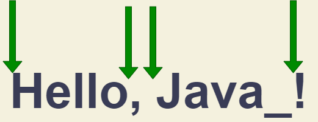

# 정규표현식
패턴과 플래그로 구성됨

## 생성
1. `regexp = new RegExp("pattern", "flags");`
2. `regexp = /pattern/flags;`   
`/`는 정규표현식의 시작과 끝을 의미함   
위 두 생성식의 차이는 템플릿문자열을 사용할 수 있냐 없냐의 차이임   

## 플래그
|플래그|의미|
|:---|:---:|
|`i`|대소문자 구분없음|
|`g`|패턴과 일치하는 모든 것을 찾음 ( 없으면 맨처음일치하는거 하나만 찾음 )|
|`m`|다중 행 모드 활성화|
|`s`|`.`이 `\n`도 포함하도록 지정|
|`u`|유니코드지원|
|`y`|문자 내 특정위치에서 검색하는 모드 활성화 ( 나중에 )|

## 
|식|의미|
|:---|:---:|
|`/`|정규표현식의 시작과 끝을 표시|
|`()`|그룹지정|
|`(?:)`|찾지만 기억하지않음|
|`[]`|하나라도 만족하면|
|`[a-zA-z0-9]`|하나라도 만족하면|
|`[^a-zA-z0-9]`|제외|
|a`?`|`a`가 0개 or 1개 `{0,1}`과 같음|
|a`*`|`a`가 0개 이상 `{0,}`과 같음|
|a`+`|`a`가 1개 이상 `{1,}`과 같음|
|a`{2}`|`a`가 2개|
|a`{2,}`|`a`가 2개이상|
|a`{2, 5}`|`a`가 2 ~ 5개|
|`\b`ab|단어의 맨앞의 `ab`만 찾음|
|ab`\b`|단어의 맨뒤의 `ab`만 찾음|
|`\B`ab|단어의 맨앞이 아닌 `ab`만 찾음|
|ab`\B`|단어의 맨뒤가 아닌 `ab`만 찾음|
|`^`ab|문장의 시작인 `ab`를 찾음|
|ab`$`|문장의 끝인 `ab`를 찾음|
|`.`|모든 문자|
|`\.`|약속된 문자 찾기 (`\`)|
|`\D`|숫자 제외 찾기|
|`\w`|모든 문자열 찾기|
|`\W`|문자열 제외 모두 찾기|
|`\s`|띄어쓰기 모두 찾기|
|`\S`|띄어쓰기 제외 모두 찾기|
|`\d`|숫자|

## javascript에서 사용
### 1. string.match()
```javascript
let str = "aa we will, we will rock you";

console.log(str.match(/we/gi));   // 1. ["we", "we"]  

console.log(str.match(/we/i));    // 2. {0: "we", index: 3, input: "aa we will, we will rock you", group: undefined}

console.log(str.match(/HTML/gi)); // 3. null
```
1. `g`사용시 일치하는 모든 것을 배열로 반환
2. `g`미사용시 일치하는 것중에 제일 처음문자열과 추가정보들 배열로 반환
  + `index`: 문자열에서 찾은 문자의 시작인덱스위치
  + `input`: 검색한 문자열
  + `gruop`: ?
3. 모두 불일치시 `null`반환

### 2. string.replace()
```javascript
let str = "we will do something, we will rock you";

str.replace(/we/i, "I");    // "I will do something, we will rock you"


let str2 = "I love cc";

str2.replace(/c/i, "$&++");           // "I love c++c"
str2.replace(/c/i, "$`++");           // "I love ++c"
```
1. `$&` : 일치문자뒤에 추가
2. `$\`` : 일치문자 없애고 일치문자 앞에 추가
3. `$'` : 일치문자 뒤에 추가
4. `$n` : 
4. `$<name>` : 
4. `$$` : 

### 3. regexp.test()
`정규표현식객체.test(string)`는 일치결과가 하나라도 존재하면 true반환
```javascript
let str2 = "I love cc";
const regexp = /cc/i;

console.log(regexp.test(str2));   // true
```

### 4. 예시
```javascript
let str = "+7(903)-123-45-67";

console.log(str.match(/\d/g).join(''));  // 79035419441
console.log(str.replace(/\D/g, ""));     // 79035419441

console.log("A\nB".replace(/\A.B/, "success"));       // "A\nB"   // 교체안됨
console.log("A\nB".replace(/\A.B/s, "fail"));         // "fail"   // 교체됨
```
1. `\d` : 숫자 ( 0 ~ 9 )
2. `\s` : 화이트스페이스 ( 공백, `\n`, `\t`, `\v`, `\f`, `\r` )
3. `\w` : 단어, 숫자, `_` ( 공백도 하나의 문자임 )
4. `.` : 모든 문자 ( `\n`제외 단, 플래그 `s`를 사용하며 `\n`도 선택됨 )

`\D`, `\S`, `\W`는 기존결과의 반대로 생각하면 됨

### 5. 유니코드와 u플래그
기본적으로 문자는 2byte로 인코딩 되어 있음    
하지만 2byte로 모든 문자를 표현하기 불가능하므로 일부 문자는 4byte로 표현되어있고   
4byte짜리 문자는 2byte짜리 2개가 합쳐져야 정확한 의미를 가진 하나의 문자로 표현할 수 있음   
그 문자들을 `서로게이트 쌍`이라고 부름    
기본적으로 정규표현식도 긴 문자를 2byte문자 두개로 취급하므로 문제가 생길 수 있음   
이것을 해결하기위해 정규표현식에서 `서로게이트 쌍`이 존재하면 `u`플래그를 넣어주면 됨   

### 6. 문자열의 시작과 끝
```javascript
const str = "a1:b2";
const str2 = "a1:b23";
const regexp = /^$/; 

console.log(str.match(/^\w\d:\w\d$/));    // "a1:b2"
console.log(str2.match(/^\w\d:\w\d$/));   // null
console.log(regexp.test(""));             // true
```
1. `^` : 문자열의 시작을 의미
2. `$` : 문자열의 끝을 의미   
`/^$/`와 일치하는 유일한 문자는 빈문자열

### 7. m플래그
여러행 모드 활성화    
기본적으로 `^`나 `$`를 사용할 때 
```javascript
let str = `1st place: Winnie
2nd place: Piglet
3rd place: Eeyore`;

console.log( str.match(/^\d/gm) );    // 1, 2, 3
console.log( str.match(/^\d/g) );     // 1

let str2 = `Winnie : 1
Piglet : 2
Eeyore : 3`;

console.log(str.match(/\d$/gm));    // 1,2,3
console.log(str.match(/\d\n/gm));   // 1\n ,2\n
```
문자열의 끝 => `\n`바로직전과 텍스트의 끝을 의미함... 그래서 1, 2, 3이 나온것   
(1과 2는 `\n`바로 직전이며, 3은 텍스트의 끝)    
`\n`도 문자이므로 `\n`을 기준으로 찾을 때는 `\n`을 포함해서 검색하고 텍스트의 끝은 포함하지 않게 됨   

### 8. \b
단어의 경계인지 체크함    
여기서 단어란 `\w`에 포함되는 것을 의미하며, 경계란 문자열의 처음과 끝을 의미

위 그림에서 초록색 화살표위치가 단어의 경계이며, `,`과 `!`는 `\w`에 포함되지 않으므로 단어에 포함되지 않음
```javascript
console.log("Hello, Java!".match(/\bJava\b/));        // Java
console.log("Hello, JavaScript!".match(/\bJava\b/));  // null
```

### 9. 이스케이프문자
```javascript
let regexp = new RegExp("\d\.\d");      // /d.d/
let regexp2 = new RegExp("\\d\.\\d");   // /\d\.\d/

console.log("Chapter 5.1".match(regexp));     // null
console.log("Chapter 5.1".match(regexp2));    // 5.1
console.log("Chapter 5.1".match(/\d\.\d/));   // 5.1 
```
출력의 첫줄은 결과적으로 d.d를 찾게 됨    
왜냐하면 `"\d\.\d"`를 만들 때 `\n`같은 이스케이프문자때문에 `\`가 사라지기 때문임   
따라서 정확하게 하고싶으면 `\\d\.\\d`를 객체로 만들거나 or `/\d\.\d/`자체를 match()의 인수로 넣어줘야함

### 10. []
`\w`는 `[a-zA-Z0-9_]`의 약어임    
`'𝒳'.match(/[𝒳𝒴]/u)`같은 서로게이트쌍을 찾을 땐 u플래그 붙여주기

### 11. ()
```javascript
let str = '<h1>Hello, world!</h1>';
let tag = str.match(/<(.*?)>/);

console.log(tag[0]);    // <h1>
console.log(tag[1]);    // h1
```
이외에 `groups`, `index`, `input`값도 들어가 있음

```javascript
let str = '<span class="my">';

let regexp = /<(([a-z]+)\s*([^>]*))>/;    // span과 그 이후에 나오는 것들 그룹으로 묶음

let result = str.match(regexp);
console.log(result[0]); // <span class="my">
console.log(result[1]); // span class="my"
console.log(result[2]); // span
console.log(result[3]); // class="my"
```

```javascript
let result = '<h1> <h2>'.match(/<(.*?)>/gi);        // ["<h1>", "<h2>"]    // 자세한 내용은 반환하지 않음
let results = '<h1> <h2>'.matchAll(/<(.*?)>/gi);    // 반복가능한 이터러블 객체 반환
results = Array.from(results);                      // 자세한 정보를 가진것의 배열로 반환해줌

for(let re of results) {    // 단, 반복시킬경우에는 배열로 만들필요 없음
  console.log(re[0]);       // <h1> 이후 <h2>
  console.log(re[1]);       // h1 이후 h2
}

let [tag1, ...tag2] = '<h1> <h2> <h3> <h4>'.matchAll(/<(.*?)>/gi);
// tag1에 h1정보 들어가고 tag2에 나머지가 들어감
```
자세한 정보란 `groups`, `index`, `input`등이 들어 있는 것을 의미    

### 11. 이름있는 그룹
```javascript
let dateRegexp = /(?<year>[0-9]{4})-(?<month>[0-9]{2})-(?<day>[0-9]{2})/;
let str = "2019-04-30";

let groups = str.match(dateRegexp).groups;

console.log(groups.year);     // 2019
console.log(groups.month);    // 04
console.log(groups.day);      // 30
```
`(?<그룹명>데이터)`를 사용하면 데이터를 그룹명으로 지정해서 뽑아줌

### 12. 대체그룹
```javascript
let str = "John Bull";
let regexp = /(\w+) (\w+)/;
console.log(str.replace(regexp, '$2, $1'));     // Bull, John

let regexp = /(?<firstName>\w+) (?<lastName>\w+)/;
console.log(str.replace(regexp, '$<lastName>, $<firstName>'));     // Bull, John
```
`$그룹번호` or `$<name>`

### 13. 그룹에서 제외
`(?:\w+)`처럼 `?:`를 그룹의 맨앞에 붙이면 됨

https://ko.javascript.info/regexp-backreferences    
이어서 공부하기


# 참고
1. [정규표현식](https://ko.javascript.info/regular-expressions)
2. [정규표현식테스트](https://regexr.com/)
3. [정규표현식연습](https://regexone.com/)